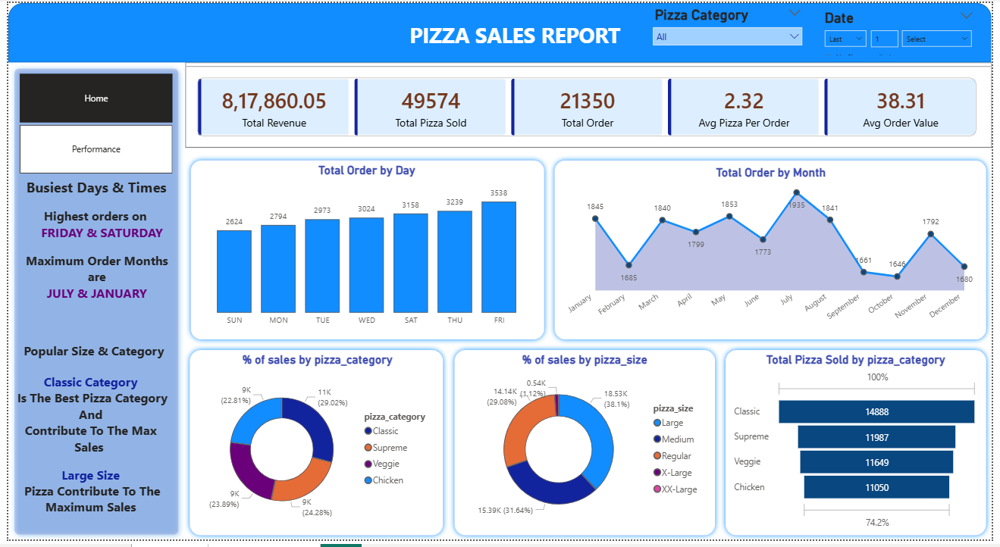

📌 Pizza Sales Data Analysis – SQL + Power BI
📊 Project Overview

This project is an end-to-end Pizza Sales Data Analysis built using PostgreSQL and Power BI.

The dataset contains 10,000+ transactional records, and the objective was to extract meaningful business insights related to revenue, customer behavior, product performance, and sales trends.

The workflow includes:

Data analysis using PostgreSQL (complex SQL queries)

Connecting PostgreSQL database to Power BI

Building an interactive dashboard for business decision-making

🛠️ Tools & Technologies Used

PostgreSQL

SQL (Joins, Aggregations, Window Functions, Group By, CTEs)

Power BI

DAX (for calculated measures and KPIs)

📂 Dataset Details

10,000+ sales records

Order-level transactional data

Pizza categories and sizes

Revenue and quantity metrics

Date and time information for trend analysis

🔍 Key Business Insights Extracted Using SQL

Total Revenue and Total Orders

Average Order Value

Revenue trend by Month and Day

Top Performing Pizzas by Revenue

Top Performing Pizzas by Order Volume

Category-wise Revenue Contribution

Peak Sales Hours

Order Distribution by Size

Advanced SQL concepts used:

GROUP BY and HAVING

JOIN operations

DATE functions

Window Functions (RANK(), DENSE_RANK())

Subqueries and CTEs

📊 Power BI Dashboard Features

The PostgreSQL database was directly connected to Power BI to enable dynamic data visualization.

Dashboard Highlights:

KPI Cards (Total Revenue, Orders, Avg Order Value)

Revenue Trend Line Chart

Category-wise Revenue Breakdown

Top 5 Pizzas by Revenue

Top 5 Pizzas by Orders

Interactive Filters (Date, Category, Size)

Navigation Buttons:

Home Page

Sales Overview Page

Top Performing Products Page

Users can navigate between pages using interactive buttons for a better user experience.

📈 Business Impact

The dashboard enables stakeholders to:

Identify high-revenue products

Understand peak demand periods

Optimize inventory planning

Improve marketing strategies

Focus on top-performing categories

📸 Dashboard Screenshots

